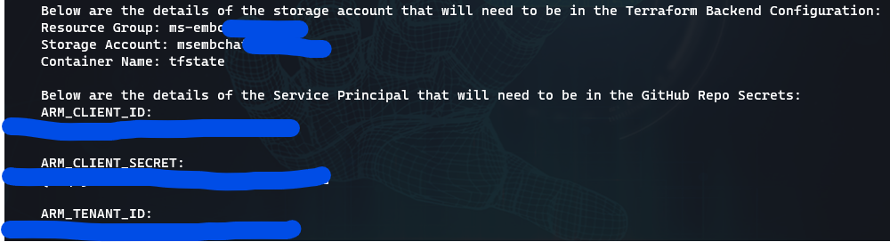
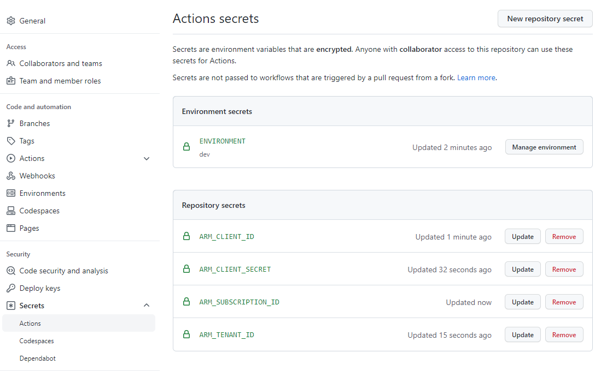

# Deploying Solution using Terraform and GitHub Actions

To deploy any of the Terraform-Azure Environments within this repository using GitHub Actions, follow the steps outlined below.

## 1. Install the Right Tools First

We have setup a Chocolatey script that will provide all the tools you need to work with Terraform on Azure - see [here](PrerequisiteInstall.ps1)

### GitHub Actions or Manual Deployment?

These solution can be deployed (recommended) using GitHub Actions as described in this guide, or using Terraform scripts locally.
To install manually, the following files are provided:

- azuredeploy.tf
- variables.tf
- terraform.tfvars
- provider.tf

These should be placed into a directory, and then Terraform initialised and applied. (Note: some larger projects split out the Terraform elements into separate files for sanity reasons.) Note that for some projects the TF Files are split out into seperate files for ease of use!

## 2. Setup the Backend Storage and Service Principal

Before we can start to run any Actions, we need two supporting items in place:

1. Backend Storage for Terraform to store the state file
2. A Service Principal for Terraform to use to authenticate to our Azure Tenant/Subscriptions

We have created an Azure CLI script that does all this for you! See [here](setup-backend.ps1)

Before running the above script, be sure to get handly all the required command line arguments for the script to run properly. Look through the beginning section of the script to see what variables are required.
>**Note**: Storage Account names must be unique so change this to something that suits your deployment! You will also need to provide a Subscription ID.

When the script runs, you will have a Storage Account and Container setup, and also you will see an output similar to the below:



Copy all of the values outputted by the script and save them somewhere. We will need them for subsequent tasks.

## 3. Configure a Terraform Backend

Within your Terraform, you will need to configure a backend. This is so that Terraform knows where you would like the State file to be stored. This will be the Azure Resources we created earlier using the Azure CLI Script (Storage Account and Container). The script outputted the values required below - be sure to use your Resource Group, Storage Account, and Container name correctly, based on the output of the Azure CLI script:

    #backend
    terraform {
      backend "azurerm" {
        resource_group_name  = "your-resource-group"
        storage_account_name = "yourstorageaccount123"
        container_name       = "tfstate"
        key                  = "terraform.tfstate"
      }
    }

Once this has been configured, save the file as `backend.tf` in the `terraform` folder.

In addition to the **backend.tf** file, you'd need to update the settings for your terraform resource group name and storage account name in the **Environment** configuration file located here: [environments.yml](environments.yml).

1. Now, open either BASH or PowerShell client and navigate to the `terraform` folder.
2. Run this command: `terraform init`
3. And now, create a new terraform workspace for your selected environment: `terraform workspace new <env>`. For example: `terraform workspace new dev`.

## 4. Configure the Secrets within the GitHub Repo

### ARM Secrets

At the end of running the CLI Script, you will also have noticed 4 outputs:

    ARM_CLIENT_ID: 
    ARM_CLIENT_SECRET: 
    ARM_TENANT_ID: 
    ARM_SUBSCRIPTION_ID:

These are the details we will need to store as Secrets - see docs [here](https://docs.github.com/en/actions/reference/encrypted-secrets), within the Repository, so that Terraform can authenticate correctly to Azure. Configure the secrets using the Settings section of the GitHub repo - name the secrets as shown in the screenshot, and paste in the outputs for each one as the earlier Azure CLI script provided:



### AD APP Secrets

In addition to the secrets generated by the CLI Script, you should have already generated or created an AD Application Registration to be associated with your Embedded Chat. If you haven't done it yet, STOP and go and create it! Here's the [article](https://docs.microsoft.com/en-us/graph/auth-register-app-v2) describing how to do that. During the App Registration steps, make sure to add the Redirect URI with the correct URI that matches the Azure Storage Account will be created with the Terraform deployment script. This is the template you can use: `https://<account_name>.blob.core.windows.net/web/auth.html`

As the result of Application Registration you should save these 2 outputs:

    **APP_CLIENT_ID**: App Registration Client Id
    **APP_CLIENT_SECRET**: App Registration Client Secret

Configure the GitHub Secrets using the Settings section of the GitHub repo - name the secrets as shown above, and paste in the outputs from the App Registration.

### Shared Access Signature Start & End Dates

To allow Azure Function App to access the Azure storage container containing the Azure Function deployment file, we need to create a Shared Access Signature during our Terraform deployment script. We could do this in various different ways, of course, but we suggest here to add additional two Environment Variables into the GitHub Secrets store:

    **SAS_START_DATE**: SAS Starting Date in `YYYY-MM-DDTHH:MM:SSZ` format
    **SAS_END_DATE**: SAS Expiration Date in `YYYY-MM-DDTHH:MM:SSZ` format

And now, we are now ready to start setting up some GitHub Actions! 😄

## 5. Generating the Function App Publishing Profile secret

If this is the first time you're deploying a Function App to Azure using GitHub Actions, you'd need to obtain the Publishing Profile secret, which is used by the CI/CD workflow. To do so, follow these steps:

1. Open Visual Studio
2. Right click on the project file and then select Publish
3. Select `Azure` for the publishing destination
4. Select `Azure Function App (Linux)` for the target
5. In `Function Instance` window, select `+` to add a new Function App
6. For the function name, enter: `ms-embchat-api`, validate that the correct subscription, resource group, plan type, storage and location are selected.
7. Click `Create`. It may take a couple of minutes for all new services to be created and deployed to Azure.
8. Click `Next` when the new services creation is complete.
9. Now, open Azure Portal and find the newly created Azure Function App.
10. Click on `Get Publishing Profile` to download the publishing profile file to your local drive.
11. Store that file somewhere you could access later. You'd need to use it in the next steps.
12. Open your GitHub repository in the Web UI.
13. Select `Settings`.
14. From the side menu, select `Secrets`, then `Actions`.
15. Click the `New repository secret` button.
16. In the `Name` field, give your secret an appropriate name. For example: `AZURE_FUNCTIONAPP_PUBLISH_PROFILE`.
17. In the `Value` field, copy and paste the content from the `Publish Profile` file. This includes all the information required for authenticating and deploying your Azure Function App to the correct slot.
18. Select `Save` when you are ready.

>Important: Do not Publish your Function App from Visual Studio!

## 6. Creating the Custom Role to allow access to Azure App Configuration resource

To assign roles, you must be signed in with a user that is assigned a role that has role assignments write permission, such as **Owner** or **User Access Administrator** at the scope you are trying to assign the role. Similarly, to remove a role assignment, you must have the role assignments delete permission.

- Microsoft.Authorization/roleAssignments/write
- Microsoft.Authorization/roleAssignments/delete
  
If your user account doesn't have permission to assign a role within your subscription, you see an error message that your account "does not have authorization to perform action 'Microsoft.Authorization/roleAssignments/write'." In this case, contact the administrators of your subscription as they can assign the permissions on your behalf.

If you are using a service principal to assign roles, you might get the error "Insufficient privileges to complete the operation." This error is likely because Azure is attempting to look up the assignee identity in Azure Active Directory (Azure AD) and the service principal cannot read Azure AD by default. In this case, you need to grant the service principal permissions to read data in the directory. Alternatively, if you are using Azure CLI, you can create the role assignment by using the assignee object ID to skip the Azure AD lookup. For more information, see [Troubleshoot Azure RBAC](https://docs.microsoft.com/en-us/azure/role-based-access-control/troubleshooting).

To assign the Service Principal you've created earlier this role, you'd need to deploy a custom role definition. The following steps provide guidance for how to do that:

1. You will create a custom role for the backend Azure resource group resource with the set of permissions provided in the
   [CustomRoleDefinition.json.template](../deploy/CustomRoleDefinition.json.template).
   First, clone `CustomRoleDefinition.json.template` file into
    `CustomRoleDefinition.json` document . Then, replace all replacement
    placeholders with corresponding values.
2. Open the Azure Portal, navigate to your backend resource group and select
    `Access Control (IAM)` menu.
3. Click `Add` in the `Create a custom role` option.
4. Select `JSON` tab, click `Edit` button and then replace the content in the
    edit window with the content from your `CustomRoleDefinition.json` document.
5. Click `Next` button and then finish creation of the new custom role: `Storage Account & Role Assignment Owner`.
    > Note: It may take a few minutes for this role to appear in the subscription.

>Important: When adding Configuration settings to Azure App Configuration resource during the Terraform deployment workflow, the Service Principal created earlier should be assigned the built-in role: **App Configuration Data Owner**.

Now, you can assign these roles to the Service Principal at the Subscription scope level. You can do it in number of ways:

- [Assign Azure role using the Azure Portal](https://docs.microsoft.com/en-us/azure/role-based-access-control/role-assignments-portal)
- [Assign Azure roles using Azure PowerShell](https://docs.microsoft.com/en-us/azure/role-based-access-control/role-assignments-powershell)
- [Assign Azure roles using Azure CLI](https://docs.microsoft.com/en-us/azure/role-based-access-control/role-assignments-cli)
- [Assign Azure roles using the REST API](https://docs.microsoft.com/en-us/azure/role-based-access-control/role-assignments-rest)

Here, we'll show how to use Azure CLI to assign Service Principal the role added with the Custom Role Definition file and the built-in role **App Configuration Data Owner**:

```azurecli
    az role assignment create --assignee "<service-principal-client-id>" --role "Storage Account & Role Assignment Owner" --subscription "<subscription-id>"
 ```

```azurecli
    az role assignment create --assignee "<service-principal-client-id>" --role "App Configuration Data Owner" --subscription "<subscription-id>"
 ```

## 7. Setting up GitHub Actions

The actions for this task are configured using YAML. To trigger the GitHub Actions workflow automatically when a new PR is merged into **main** branch, the Actions workflow has been created within this repository:

- **Build and Deploy Embedded Chat Function App to Azure** - this will setup, initialize, validate, plan and apply Terraform, based on the Terraform deployment [file](./../terraform/azuredeploy.tf).

This workflow is contained, and configured from within the `./github/workflows` folder within this repository. 

We are now ready to run GitHub Actions! ✅
