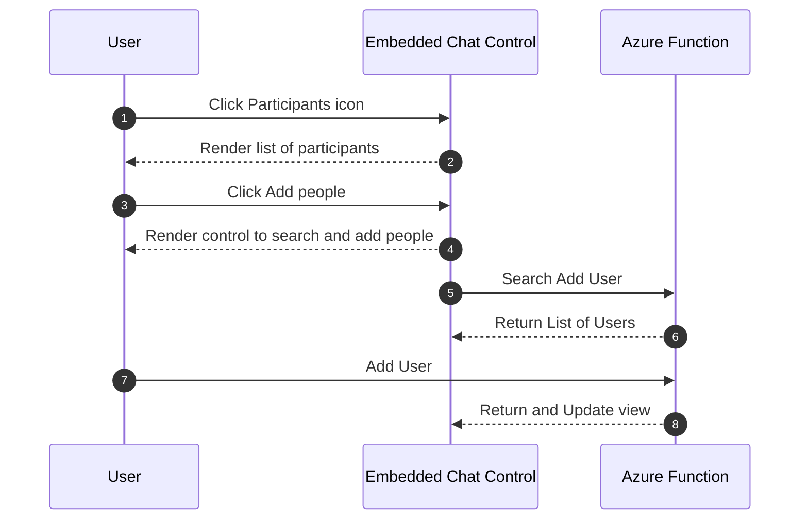

# Add User From Embedded Chat Control Flow

```mermaid
sequenceDiagram
    autonumber
    participant User
    participant Embedded Chat Control
    participant Azure Function
    User->>Embedded Chat Control: Click Participants icon
    Embedded Chat Control-->>User: Render list of participants
    User->>Embedded Chat Control: Click Add people
    Embedded Chat Control-->>User: Render control to search and add people
    Embedded Chat Control->>Azure Function: Search Add User
    Azure Function-->>Embedded Chat Control: Return List of Users
    User->>Azure Function: Add User
    Azure Function-->>Embedded Chat Control: Return and Update view
```