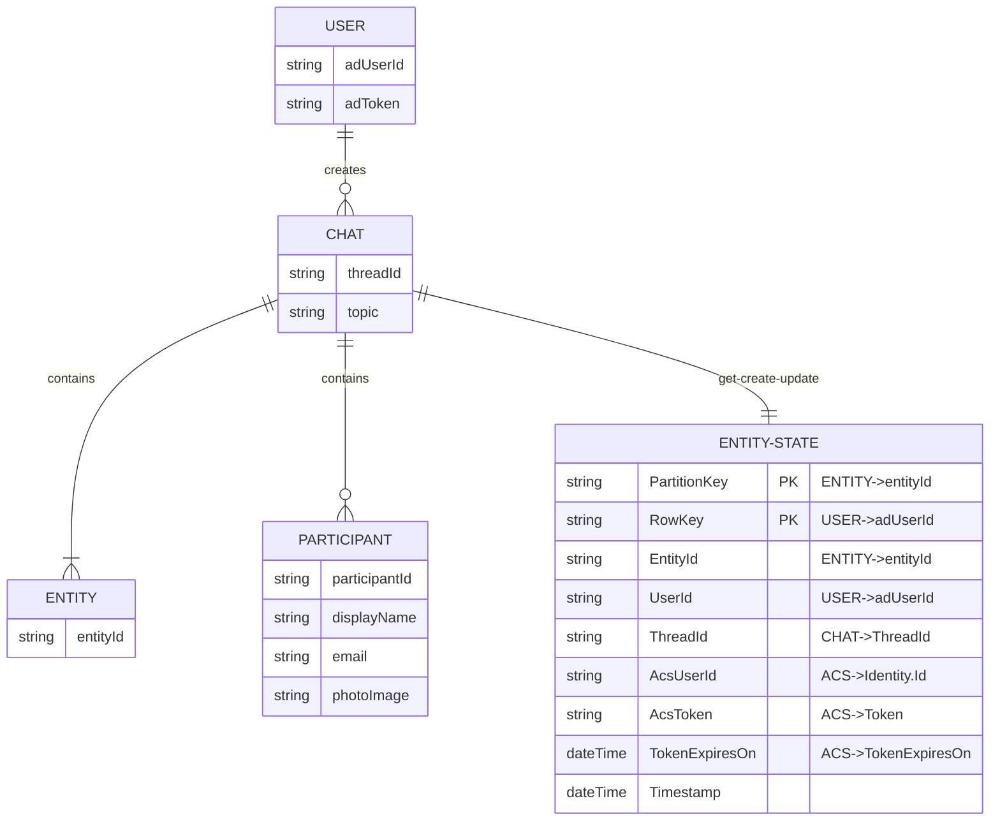

# Entity Relationship Data Model Design

```mermaid
erDiagram
    USER ||--o{ CHAT : creates
    USER {
        string adUserId
        string adToken
    }
    CHAT ||--|{ ENTITY : contains
    CHAT ||--o{ PARTICIPANT : contains
    CHAT {
        string threadId
        string topic
    }
    ENTITY {
        string entityId
    }
    PARTICIPANT {
        string participantId
        string displayName
        string email
        string photoImage
    }

    CHAT ||--|| ENTITY-STATE : get-create-update
    ENTITY-STATE {
        string PartitionKey PK "ENTITY->entityId"
        string RowKey PK "USER->adUserId"
        string EntityId "ENTITY->entityId"
        string UserId "USER->adUserId"
        string ThreadId "CHAT->ThreadId"
        string AcsUserId "ACS->Identity.Id"
        string AcsToken "ACS->Token"
        dateTime TokenExpiresOn "ACS->TokenExpiresOn"
        dateTime Timestamp

    }

```
