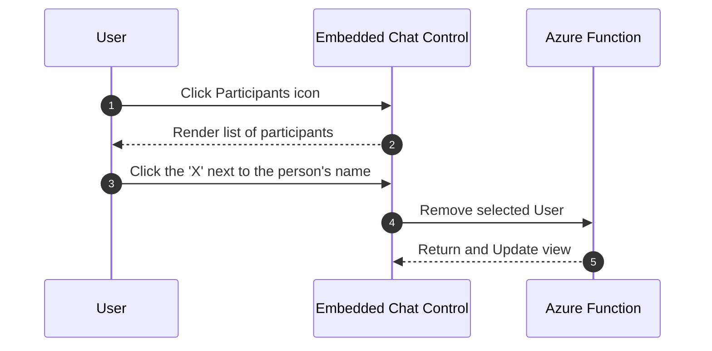

# Remove User From Embedded Chat Control Flow

```mermaid
sequenceDiagram
    autonumber
    participant User
    participant Embedded Chat Control
    participant Azure Function
    User->>Embedded Chat Control: Click Participants icon
    Embedded Chat Control-->>User: Render list of participants
    User->>Embedded Chat Control: Click the 'X' next to the person's name
    Embedded Chat Control->>Azure Function: Remove selected User
    Azure Function-->>Embedded Chat Control: Return and Update view
```