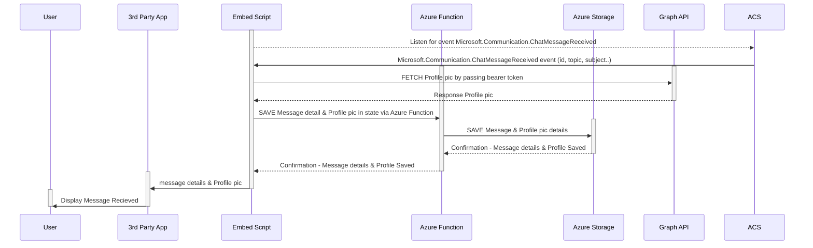

# Message Recieved Sequence Diagram

```mermaid

sequenceDiagram
    participant User
    participant 3rd Party App
    participant Embed Script
    participant Azure Function
    participant Azure Storage
    participant Graph API
    participant ACS

    
    
    activate Embed Script
    Embed Script-->>ACS: Listen for event Microsoft.Communication.ChatMessageReceived
    ACS ->>Embed Script:Microsoft.Communication.ChatMessageReceived event (id, topic, subject..)
    activate Azure Function
    activate Graph API
    Embed Script->>Graph API:FETCH Profile pic by passing bearer token
    Graph API-->>Embed Script:Response Profile pic
    deactivate Graph API
    Embed Script ->>Azure Function:SAVE Message detail & Profile pic in state via Azure Function
    activate Azure Storage
    Azure Function ->> Azure Storage: SAVE Message & Profile pic details
    Azure Storage -->>Azure Function:Confirmation - Message details & Profile Saved
    deactivate Azure Storage
    Azure Function -->> Embed Script: Confirmation - Message details & Profile Saved
    deactivate Azure Function
    activate 3rd Party App
    Embed Script->>3rd Party App: message details & Profile pic
    deactivate Embed Script
    activate User
    3rd Party App->> User: Display Message Recieved
    deactivate 3rd Party App
    deactivate User

```
    
   
    
    